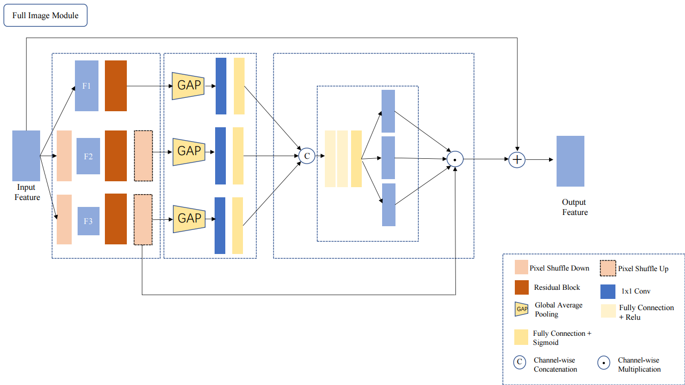
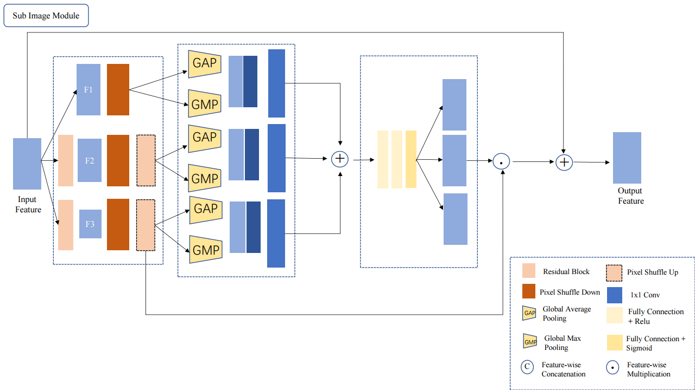

# CLC Net

## 代码结构
    torch_base 
    ├── checkpoints # 存放模型的地方 
    ├── data        # 定义各种用于训练测试的dataset 
    ├── eval.py     # 测试代码 
    ├── loss.py     # 定义各种花里胡哨的loss 
    ├── metrics.py  # 定义各种约定俗成的评估指标 
    ├── model       # 定义各种实验中的模型 
    ├── options.py  # 定义各种实验参数，以命令行形式传入 
    ├── README.md   # 介绍一下自己的repo 
    ├── scripts     # 各种训练，测试脚本 
    ├── train.py    # 训练代码 
    └── utils       # 各种工具代码

## 论文开发中 

## mileStone
  - 代码框架设置与git工具同步
  - pycharm 远程连接配置完成
  - 环境搭建
  - 完成初版网络
  - 网络代码结构重构
  - 网络重构

## requirement
    - cudatoolkit=11.3.1
    - numpy=1.21.5
    - python=3.8.13
    - pytorch=1.10.1
    - pyyaml=6.0
    - tensorboardx=2.2
    - torchaudio=0.10.1
    - torchvision=0.11.2
    - tqdm=4.63.0
    - pip
    - pip:
      - gdown==4.5.1
      - lpips==0.1.4
      - opencv-python==4.5.5.64
      - scikit-image==0.19.2
      - thop==0.0.31-2005241907

## 框架图

## 实验问题与缺陷
    - 网络对细节的修复效果较差

