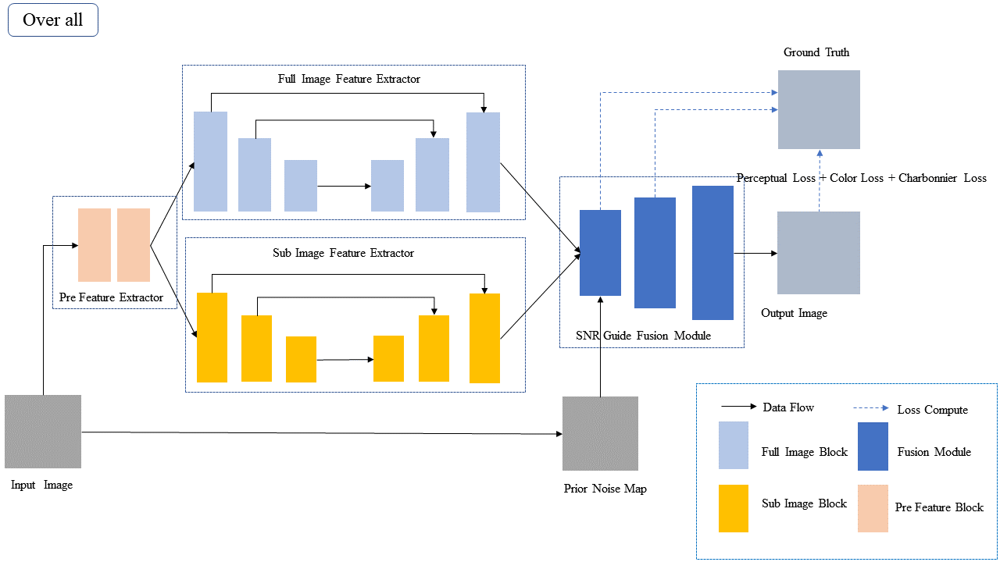
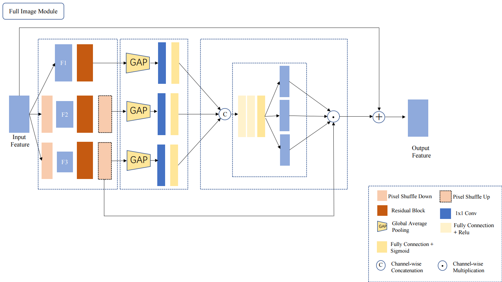
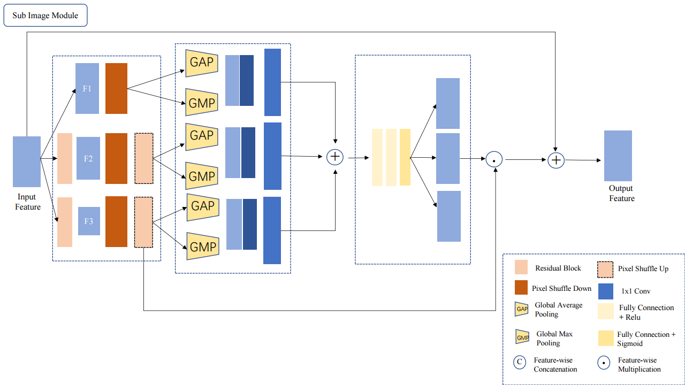

# CLC Net

## Code structure
    torch_base 
    ├── checkpoints # Place to store the model 
    ├── dataset        # Define various datasets for training and testing
    ├── loss_util.py     # Define all kinds of fancy loss
    ├── model       # Define models in various experiments
    ├── config  # Define various experimental parameters and input them in the form of yaml
    ├── README.md   # Introduce my repo
    ├── scripts     # Various trainings and test scripts
    ├── train.py    # Training Code
    └── utils       # Various tool codes

## MileStone
    1. Code framework settings are synchronized with git tools
    2. The pycharm remote connection configuration is complete
    3. Environment construction
    4. Complete the first version of the network
    5. Network code structure reconstruction
    6. Network reconfiguration
    7. Add hole convolution and CA mode to fuse encoder and decoder

## requirement
    - cudatoolkit=11.3.1
    - numpy=1.21.5
    - python=3.8.13
    - pytorch=1.10.1
    - pyyaml=6.0
    - tensorboardx=2.2
    - torchaudio=0.10.1
    - torchvision=0.11.2
    - tqdm=4.63.0
    - pip
    - pip:
      - gdown==4.5.1
      - lpips==0.1.4
      - opencv-python==4.5.5.64
      - scikit-image==0.19.2
      - thop==0.0.31-2005241907

## Frame Diagram

## How to use
    train  bash scripts/train.sh
    test   bash scripts/test.sh 

## Experimental problems and defects
    - The network has poor repair effect on details

